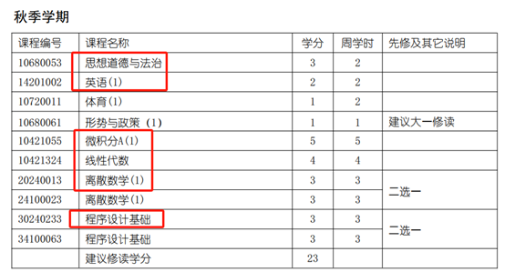
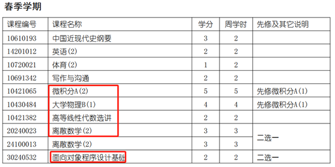
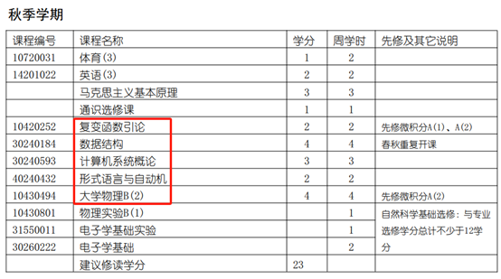
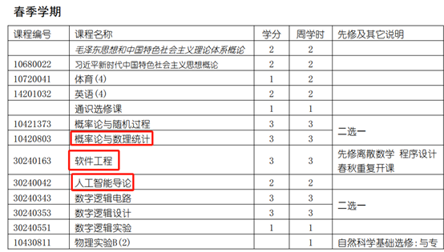
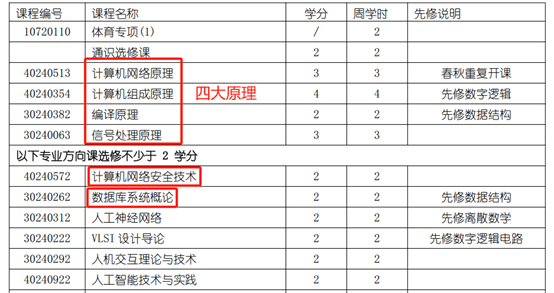
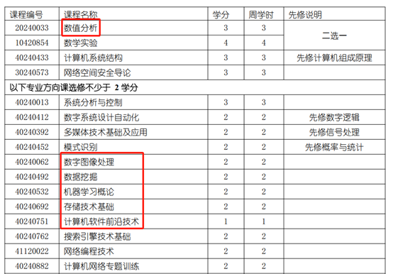
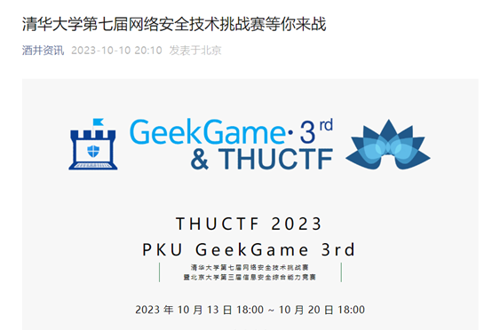
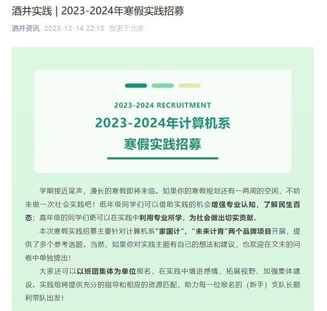
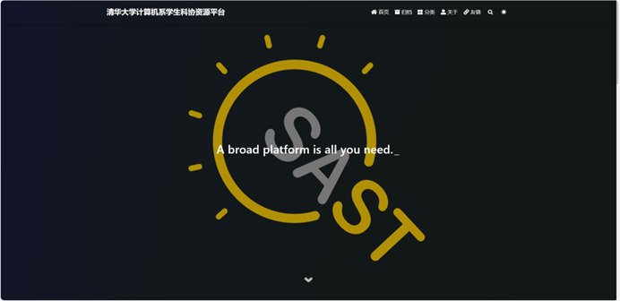

## 院系概况

21 世纪以来，计算机科学与技术已深入到人类活动的各个领域，对人类社会的进步与发展产生了巨大的影响。在互联网贯通全球和人工智能迅猛发展的时代，计算机科学与技术是信息革命永恒不变的技术核心。

在清华大学计算机科学与技术系，学生的培养始终保持“宽口径，厚基础”的目标，通过对计算机核心专业知识进行全面、深度的学习和实践，培养有潜力引领计算机学界潮流的“学术大师”和叱咤业界风云的“兴业之士”。毫不夸张地说，清华大学计算机系是全国计算机专业的顶流。

## 培养方案

### 大一

大一上学期会有每个理工科学生都需要上的《微积分》、《线性代数》两门“硬核”数学课，以及步入计算机编程之门的《程序设计基础》。

大一下学期将会在继续夯实数理基础的同时学习《面向对象程序设计》，这门课会让你掌握在“会”的基础上继续精益求精，掌握编程的艺术以及技巧。

### 大二

进入大二之后，会系统学习《数据结构》《计算机系统概论》《形式语言与自动机》等课程。~~笔者刚考完数据结构，期末卷面满分100分，期望得分20分。~~《计算机系统概论》这门课顾名思义，是计算机系统方向的入门课程，它是以后相关课程的基石。

大二下学期还会学习《软件工程》《概率论与数理统计》《人工智能导论》三门比较重要的课程。软工的学习将会带你完整走一遍前后端开发以及部署的流程，人智导则会让你“手搓”一个人工智能在线上平台与其他同学的程序进行比赛。

### 大三大四

到了大三大四之后，必修课将会越来越少，取而代之的将会是很多“选修课”——也就是说，你只需要在二十几门课程中选择自己比较感兴趣的几门来进行学习即可。当然，想要安稳度过大三，就必须要跨过“四大原理”这四座大山。这四门课，都是一个合格的具有计算机知识储备素养的人需要掌握的。例如，《计算机组成原理》这门课的口号是：“奋斗三星期，造台计算机”。

## 特色活动

### 清华大学网络安全技术挑战赛

清华大学网络安全技术挑战赛采用网络安全竞赛领域常见的  CTF（夺旗赛） 解题模式，持续时间为一周，题目难度梯度提升，在保证题目质量的同时，也有对新手循序渐进的引导。题目类型既包括 Web 安全、逆向工程、二进制漏洞挖掘和利用、密码学、安全杂项等，也涉及目前前沿的人工智能安全等，希望能给各参赛选手带来良好的比赛体验，在比赛中学到有用的网络安全技术。

### “学术新星计划”

“学术新星计划”是清华大学计算机系的一项因材施教的人才培养项目，旨在为对学科前沿研究工作感兴趣的大二、大三的同学，提供进入实验室参与科研工作的机会。每年，超过一百名本科生加入学术新星计划，匹配本系专门的导师进行科研指导。2022-2023 年，超过两百多人次本科生报名参加了常规新星计划（秋季）与暑期专项计划。

### 寒暑假社会实践

### 学生科学技术协会资源平台

清华大学计算机系学生科协资源平台由清华大学计算机系学生科协联创中心建立并维护，是一个专门用于收集并展示实习信息等各种有用资源，免费为有需求的同学提供服务的平台。所在网址为 [https://stu.cs.tsinghua.edu.cn/resources/](https://stu.cs.tsinghua.edu.cn/resources/)

目前主要集中收集的是实习招募信息。考虑到日活量等需求，平台暂时存放、更新的是有效期较长的内容。后续再根据网站发展情况进行调整。

## 前景展望

计算机科学与技术系每学期都会组织系内同学参观大型IT企业，让同学有机会了解业界最前沿的技术。本科生毕业后有 84% 左右的同学选择继续深造，其中 16% 的同学前往国外著名高校如麻省理工学院、斯坦福大学、卡耐基-梅隆大学、康奈尔大学、牛津大学等；15% 左右的同学为定向培养或选择直接就业，就业单位包括国内外著名IT企业，如微软、腾讯、阿里巴巴、字节跳动、抖音、谷歌、国家实验室等，也有部分学生选择自主创业。

| 2022 届本科生毕业去向 | 人数 | 占比  |
| :-------------------- | :--: | :---: |
| 本校读研              | 103  | 58.2% |
| 国内其他高校读研      |  17  | 9.6%  |
| 境外深造              |  29  | 16.4% |
| 就业                  |  27  | 15.3% |
| 其他                  |  1   | 0.6%  |
| 共计                  | 177  | 100%  |

## 自己的生活体验

进入清华大学计算机系学习的都是学习能力强、十分优秀的同学，而计算机系的课程又一直以来都以“难”著称，因此最初给我在计算机系里的学习生活造成了极大的阻力。但是由于我一直向往学习计算机科学，所以我也算是在“苦中作乐”吧。

进入清华之后，我受到的第一个教训就是“接受自己的平庸”。大一时我经常与周围的同学进行比较。结果是，绩点成绩不如别人，体育奖项不如别人，科研科创不如别人，社工经历不如别人。同学间流传的一句话很有意思：“在清华，在任何你擅长的领域内，都一定能找到比你更厉害的人。”所以，人与人之间的比较是没有意义的，每个人只需要跟自己比较；如果自己相对于过去的自己有进步，那么也就无憾了。

在那之后我就一直专注于自身，在保证自己成绩优秀的同时，慢慢找到自己的兴趣爱好并努力去追求它们。我对我自己的大学生活步入正轨感到满意，也希望大家能够从我的经验体会中汲取教训、少走弯路吧。
